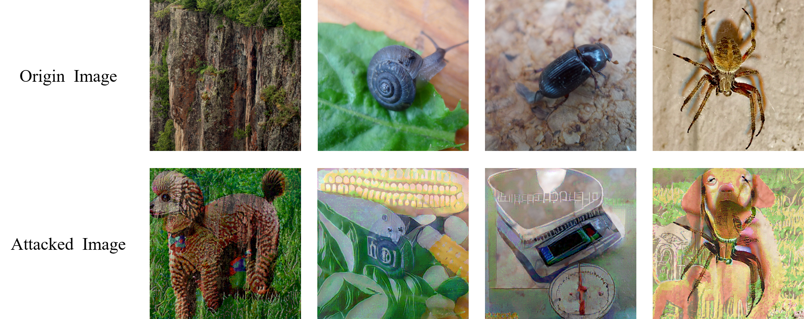

# Attack-ImageNet

No.3 solution of Tianchi ImageNet Adversarial Attack Challenge. Team member: @[Equation](https://github.com/Equationliu), @[LayneH](https://github.com/LayneH)

We use PGD (with learning rate decay) to attack the defense model. 

Tricks:

1. Trade-off between non-targeted loss and targeted loss.
2. Ensemble multi-scale, flip loss.
3. Ensemble multi pre-trained (adversarial training) model by averaging their logits.

Part of the attacked images:



## Environment

python=3.6.9, pytorch=0.4.1, numpy=1.16.4, pandas=0.25.0

## Prepare	

The origin tensorflow models are from [Facebook:ImageNet-Adversarial-Training](https://github.com/facebookresearch/ImageNet-Adversarial-Training/blob/master/INSTRUCTIONS.md) [1]. Corresponding pytorch models can be download from [Google Drive](https://drive.google.com/file/d/1_WdgQD4Z1Y1EHxCKiCZDw_mGhGuayNjv/view?usp=sharing) or [BaiduPan](https://pan.baidu.com/s/1xmlycV7N7HjqDdezsV1aGg) ,  then extract them to folder `adv_denoise_model`.
> The denoise pytorch models are directly got from [TREMBA](https://github.com/TransEmbedBA/TREMBA) [2].

## Run

You just need to run:

```bash
CUDA_VISIBLE_DEVICES=0 python main.py --img_path YOUR-IMAGE-PATH
```
## Reference

[1] Xie, Cihang, et al. "Feature denoising for improving adversarial robustness." Proceedings of the IEEE Conference on Computer Vision and Pattern Recognition. 2019.

[2] Huang Z, Zhang T. Black-Box Adversarial Attack with Transferable Model-based Embedding[J]. arXiv preprint arXiv:1911.07140, 2019.